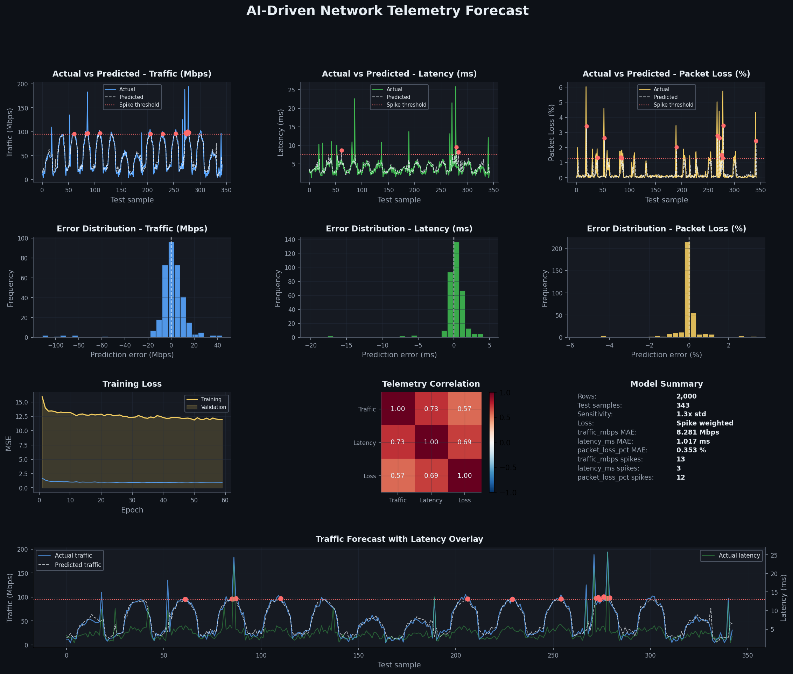
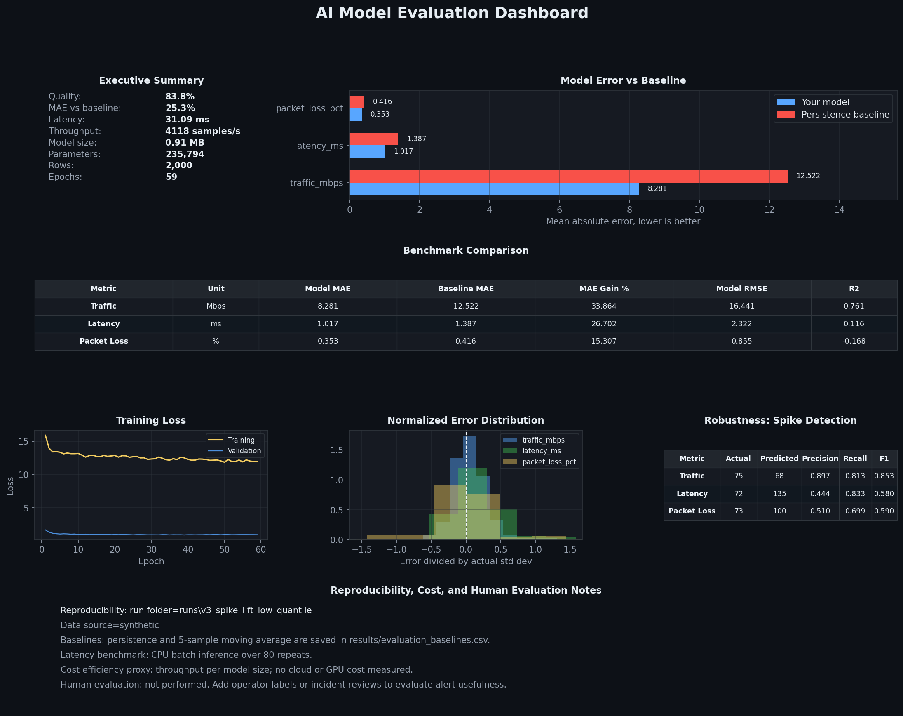
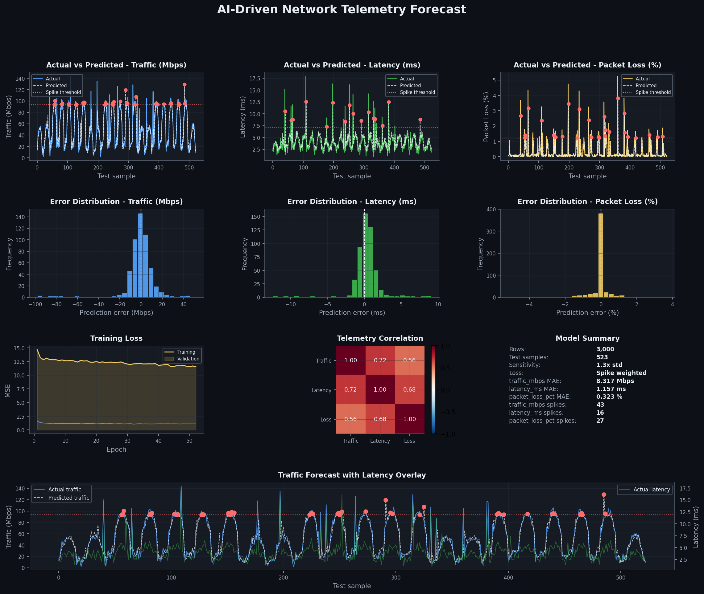
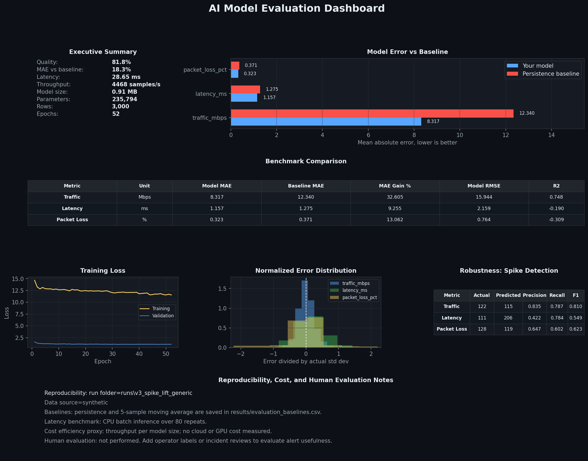

# NetFlow-Forecaster

AI-powered network telemetry forecasting for traffic, latency, and packet loss.

NetFlow-Forecaster turns telemetry CSVs, synthetic trials, Kaggle flow data, and
live ContainerLab samples into reproducible forecasting runs with dashboards,
baseline comparisons, spike metrics, and model artifacts.

## Highlights

- Forecasts `traffic_mbps`, `latency_ms`, and `packet_loss_pct` together.
- Uses chronological time-series splits and train-only scaling.
- Trains a hybrid attention-LSTM plus Gradient Boosting ensemble.
- Compares results against persistence and moving-average baselines.
- Tracks spike precision, recall, and F1 instead of only aggregate loss.
- Produces dashboards, JSON summaries, CSV reports, model files, and readable
  model reports for every complete run.
- Includes synthetic, Kaggle, local CSV, and live ContainerLab workflows.

## Current Evidence

The strongest checked-in evidence is a 2000-row synthetic benchmark from the V4
self-learning loop. It is useful as a reproducible demo, not as a claim of
production readiness.

| Dataset | Rows | Quality | MAE vs Persistence | Traffic Spike F1 | Status |
|---|---:|---:|---:|---:|---|
| Synthetic | 2000 | 83.6% | +25.2% | 0.851 | Best checked-in demo |
| Generic `ml/telemetry.csv` | 3000 | 81.2% | +18.4% | 0.810 | Local CSV demo |

The requested `>=90%` quality gate was not reached by these measured evidence
runs. The synthetic and generic demos do beat persistence on every tracked MAE
target and pass the traffic spike F1 gate.

Dashboard examples:









Tracked evidence files:

- `docs/results/synthetic_evaluation_summary.json`
- `docs/results/synthetic_evaluation_baselines.csv`
- `docs/results/synthetic_evaluation_spikes.csv`
- `docs/results/generic_evaluation_summary.json`
- `docs/results/generic_evaluation_baselines.csv`
- `docs/results/generic_evaluation_spikes.csv`
- `docs/results/sequence_model_comparison.csv`

## How It Works

All data paths normalize into the same schema:

```text
timestamp,traffic_mbps,latency_ms,packet_loss_pct
```

The pipeline then follows this flow:

```text
telemetry CSV
  -> feature transforms and chronological split
  -> LSTM temporal model
  -> Gradient Boosting lag/rolling-feature model
  -> validation-tuned ensemble and residual blend
  -> dashboards, evaluation summaries, and model artifacts
```

The LSTM branch learns sequence behavior from lookback windows. The Gradient
Boosting branch is strong on lag, rolling-window, and abrupt spike features. The
evaluation layer checks whether the result actually beats simple baselines.

## Repository Layout

```text
.
├── runners/                  # Cross-platform and shell-specific entrypoints
│   ├── run.py                # Primary runner
│   ├── run.ps1               # Windows PowerShell wrapper
│   └── run.sh                # Linux/WSL wrapper
├── ml/                       # Training, data loading, evaluation, dashboards
├── scripts/                  # Live telemetry collection and cleanup helpers
├── containerlab/             # ContainerLab topology
├── configs/                  # FRR router configs
├── docs/
│   ├── images/               # Checked-in dashboard evidence
│   └── results/              # Checked-in evaluation evidence
├── tests/                    # Pytest coverage
└── .github/                  # CI and community templates
```

## Setup

PowerShell:

```powershell
cd "C:\path\to\NetFlow-Forecaster"
Set-ExecutionPolicy -Scope Process -ExecutionPolicy Bypass
python -m pip install -r requirements.txt
```

Bash:

```bash
cd NetFlow-Forecaster
python -m pip install -r requirements.txt
```

If ONNX-related installation fails on Windows, install the exporter dependency
directly:

```powershell
python -m pip install --trusted-host pypi.org --trusted-host files.pythonhosted.org onnx onnxscript
```

## Quick Start

Cross-platform Python runner:

```powershell
python runners\run.py synthetic --samples 2000 --epochs 40
```

Windows wrapper:

```powershell
.\runners\run.ps1 synthetic -Samples 2000 -Epochs 40
```

Linux/WSL wrapper:

```bash
bash runners/run.sh synthetic --samples 2000 --epochs 40
```

Fast smoke run:

```powershell
.\runners\run.ps1 synthetic -Samples 300 -Epochs 3 -SkipInstall
```

Universal benchmark on `ml/telemetry.csv`:

```powershell
.\runners\run.ps1 benchmark -TargetQuality 90 -MaxAttempts 12
```

## Common Workflows

### Synthetic Trial

```powershell
.\runners\run.ps1 synthetic -Samples 2000 -Epochs 40
```

### Kaggle Trial

```powershell
.\runners\run.ps1 kaggle -Samples 5000 -Epochs 60
```

### Local CSV Training

Place a CSV at `ml/telemetry.csv` with:

```text
timestamp,traffic_mbps,latency_ms,packet_loss_pct
```

Then run:

```powershell
.\runners\run.ps1 train -Epochs 80
```

### Manual End-To-End Trial

```powershell
python ml\enhanced_train.py --data ml\telemetry.csv --output-dir runs\sample_hybrid_trial --epochs 40 --device auto
python ml\visualize.py --data runs\sample_hybrid_trial\raw_data\telemetry.csv --output-dir runs\sample_hybrid_trial --sensitivity 1.3
python ml\evaluate_model.py --run-dir runs\sample_hybrid_trial
python ml\export_model_report.py --run-dir runs\sample_hybrid_trial
```

### Dataset-Optimized Tree Model

```powershell
.\runners\run.ps1 dataset_opt -SkipInstall
```

### Sequence Model Ablation

```powershell
python ml\compare_sequence_models.py --data ml\telemetry.csv --output-dir runs\sequence_comparison --epochs 40
```

This compares LSTM, GRU, mean-pooling LSTM, and attention-LSTM variants on the
same chronological split.

### Live ContainerLab Workflow

ContainerLab is Linux-focused. Use Linux, WSL2, or a Linux VM with Docker and
ContainerLab installed.

PowerShell:

```powershell
.\runners\run.ps1 deploy
.\runners\run.ps1 live -Samples 120 -Interval 10 -Epochs 80
.\runners\run.ps1 destroy
```

Bash:

```bash
bash runners/run.sh deploy
bash runners/run.sh live --samples 120 --interval 10 --epochs 80
bash runners/run.sh destroy
```

## Run Outputs

Each complete run is written under `runs/` and usually contains:

```text
raw_data/telemetry.csv
results/predictions.csv
results/actuals.csv
results/prediction_intervals.csv
results/train_losses.csv
results/evaluation_comparison.csv
results/evaluation_baselines.csv
results/evaluation_spikes.csv
json/metrics.json
json/evaluation_summary.json
json/model_metadata.json
json/model_readable_summary.json
images/traffic_prediction_dashboard.png
images/model_evaluation_dashboard.png
model/lstm_model.pth
model/gb_model.joblib
model/model_readable_report.md
```

The `runs/` directory is ignored by git because it can contain large generated
models and experiment artifacts. The curated evidence copied into `docs/` is
tracked.

## Model Notes

The current hybrid trainer uses:

- Additive temporal attention over LSTM time steps.
- LayerNorm and a residual final-state connection.
- Gradient Boosting over lag and rolling-window features.
- Validation-tuned per-feature ensemble weights.
- Optional ONNX export for the LSTM component.
- Residual-normal 95% forecast bands.
- Automatic CUDA use when PyTorch detects a GPU.

Important limitations:

- The attention model is not a Transformer or Temporal Fusion Transformer.
- Prediction intervals are approximate, not full probabilistic forecasts.
- Synthetic performance does not guarantee live-network performance.
- External data quality, spike frequency, and split behavior can change results
  substantially.

## Testing

```powershell
python -m compileall ml scripts runners
python -m pytest
```

CI also compiles the ML scripts, runs tests, and executes an auto-benchmark
smoke check.

## Troubleshooting

If PowerShell blocks scripts:

```powershell
Set-ExecutionPolicy -Scope Process -ExecutionPolicy Bypass
```

If ONNX export fails with `ModuleNotFoundError: No module named 'onnxscript'`:

```powershell
python -m pip install onnx onnxscript
```

If a run fails after training but before dashboards, rerun the final steps:

```powershell
python ml\visualize.py --data runs\<run_folder>\raw_data\telemetry.csv --output-dir runs\<run_folder>
python ml\evaluate_model.py --run-dir runs\<run_folder>
python ml\export_model_report.py --run-dir runs\<run_folder>
```

## Community

- See [.github/CONTRIBUTING.md](.github/CONTRIBUTING.md) for development workflow.
- See [.github/CODE_OF_CONDUCT.md](.github/CODE_OF_CONDUCT.md) for community expectations.
- See [.github/SECURITY.md](.github/SECURITY.md) for vulnerability reporting.
- See [.github/SUPPORT.md](.github/SUPPORT.md) for help and support channels.
- This project is released under the [MIT License](LICENSE).
