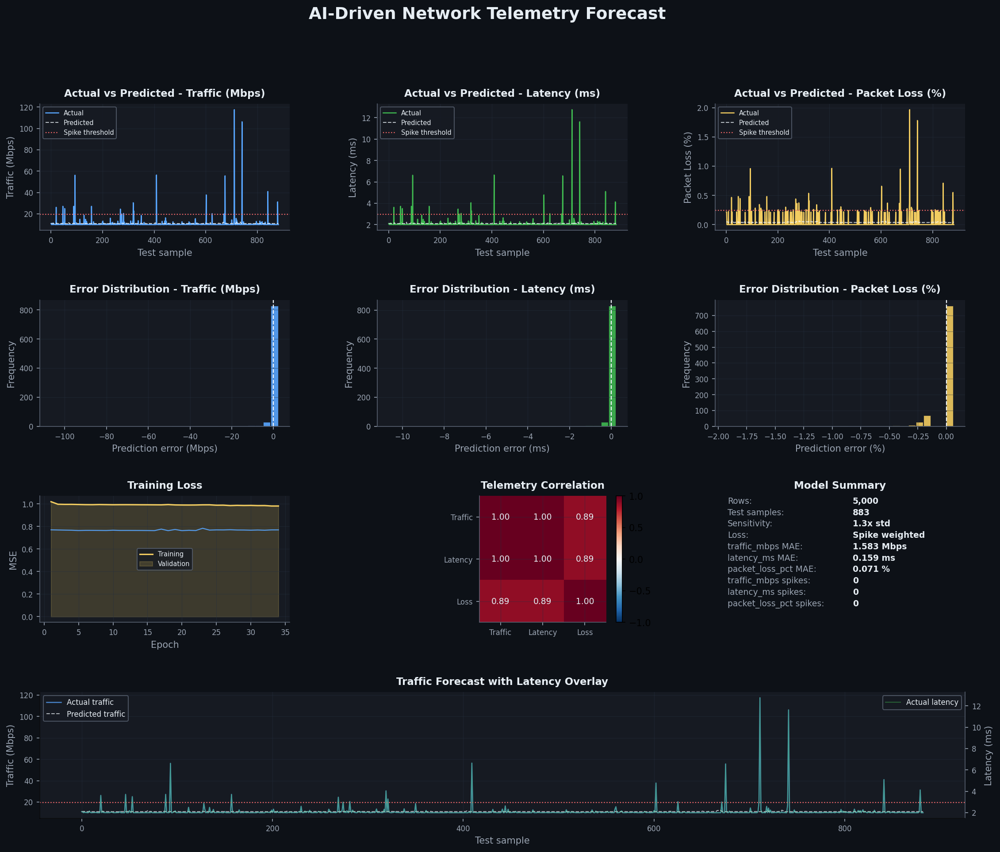
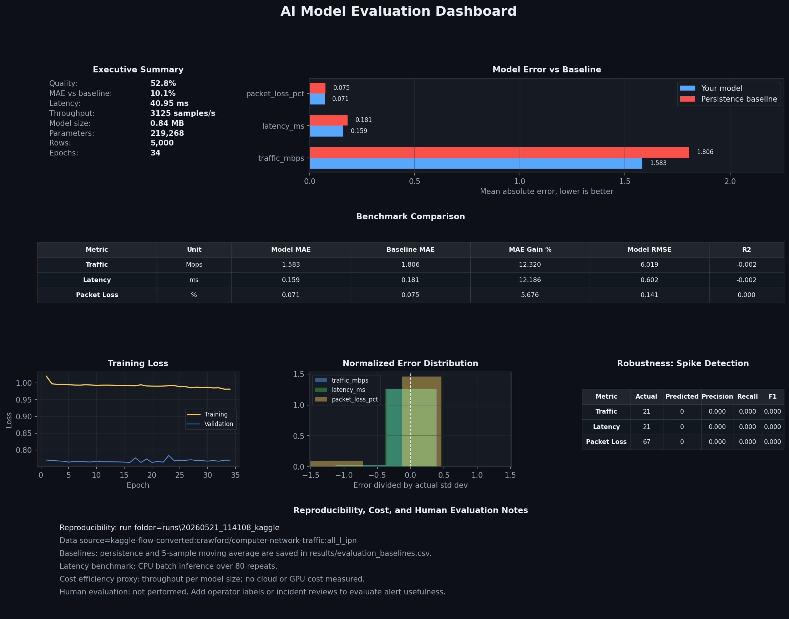

# AI-Driven Network Design and Traffic Prediction

This project builds a network telemetry prediction pipeline around synthetic,
Kaggle, and live ContainerLab data. The current default trainer is a hybrid
ensemble: a stacked LSTM learns temporal sequence behavior, while Gradient
Boosting learns engineered lag, rolling-window, and spike features. The two
models are blended into one forecast for traffic, latency, and packet loss.

The pipeline can run fully offline with synthetic telemetry, train from a local
CSV, pull a Kaggle network dataset, or collect live telemetry from a deployed
ContainerLab spine-leaf topology.

## What Is Included

- Synthetic telemetry generator for offline trials.
- Kaggle loader for `crawford/computer-network-traffic`.
- Live ContainerLab collector for traffic, latency, and packet loss.
- Hybrid ensemble trainer in `ml/enhanced_train.py`.
- Original LSTM trainer in `ml/train_model.py` kept as a reference.
- Dataset-optimized tree trainer in `ml/train_kaggle_model.py`.
- ONNX export for the LSTM component.
- Dashboards for forecasts, training loss, errors, correlations, and spikes.
- Model evaluation reports, readable summaries, and baseline comparisons.

## Current Default Model

`run.ps1 synthetic`, `run.ps1 kaggle`, `run.ps1 live`, and `run.ps1 train`
currently call `ml/enhanced_train.py`.

That trainer creates:

- `model/lstm_model.pth`: PyTorch LSTM sequence model.
- `model/lstm_model.onnx`: optional ONNX export of the LSTM component when `--export-onnx` is used and exporter dependencies are available.
- `model/gb_model.joblib`: Gradient Boosting spike/tabular component.
- `results/predictions.csv`: blended ensemble predictions.
- `results/actuals.csv`: matching actual values.
- `results/prediction_intervals.csv`: residual-based 95% forecast bands.
- `results/train_losses.csv`: LSTM training and validation losses.
- `json/metrics.json`: training settings and model metrics.
- `json/scaler_params.json`: input and target scaler metadata.

The trainer starts from `65%` Gradient Boosting and `35%` LSTM, then tunes the
blend per target on a chronological validation slice. A final validation-tuned
one-step persistence residual blend is also available inside the trainer. That
residual branch is useful for next-step forecasting because the previous
observed sample is known at inference time; it is not a claim that the model can
see the current target.

The current neural component is a stacked LSTM with temporal attention,
LayerNorm, and a residual connection from the final hidden state.
Older run metadata may contain `attention_lstm` or `hybrid_lstm_gradient_boosting`
from earlier experiments, but new hybrid runs are labeled
`hybrid_attention_lstm_gradient_boosting`.
The trainer uses CUDA automatically when PyTorch can see a GPU, and otherwise
falls back to CPU.

## How The Pieces Connect

The project has three main data paths:

- Synthetic data: `ml/generate_data.py` creates offline telemetry for demos and
  repeatable experiments.
- Kaggle data: `ml/load_kaggle_data.py` loads external network traffic rows for
  larger dataset-style trials.
- Live data: `scripts/collect_telemetry.py` samples a running ContainerLab
  topology.

Those paths all produce the same core columns:

```text
timestamp,traffic_mbps,latency_ms,packet_loss_pct
```

The runner scripts connect the pipeline:

- `run.ps1` is the main Windows entrypoint.
- `run.sh` is the Linux/WSL entrypoint.
- `ml/enhanced_train.py` trains the current hybrid model.
- `ml/visualize.py` creates the prediction dashboard and spike summary.
- `ml/evaluate_model.py` compares the model against simple baselines.
- `ml/export_model_report.py` writes human-readable model summaries.
- `ml/compare_sequence_models.py` runs controlled LSTM/GRU/attention ablations.
- `ml/metrics_utils.py` centralizes quality, weighted MAE, and spike scoring helpers.

Why each part matters:

- The LSTM branch learns temporal sequence behavior from lookback windows.
- The Gradient Boosting branch uses lag and rolling-window features that are
  often strong for abrupt tabular spike patterns.
- The ensemble weight search uses validation data to choose per-feature blends
  instead of assuming one fixed weight is always best.
- The persistence residual branch tests whether the learned model adds value
  over a strong one-step baseline.
- The dashboards make model behavior inspectable instead of hiding everything
  behind one score.
- The ablation runner helps prove whether attention or other sequence changes
  actually help on the current dataset.

## Current Limitations

- The neural model has temporal attention, but it is not a Transformer or a
  Temporal Fusion Transformer.
- This is an experimentation pipeline, not a proven production deployment.
- Quality depends on the dataset, split, spike frequency, and dashboard
  sensitivity. Trust the generated evaluation artifacts for each run rather
  than any fixed README quality claim.
- Prediction intervals are residual-based approximations, not a full
  probabilistic forecasting model.
- The LSTM scalers are fit on the chronological training slice only; validation
  and test windows are transformed with those fitted scalers.

## Project Layout

```text
ai_network_project/
  containerlab/topology.clab.yml
  configs/frr/*/frr.conf
  scripts/collect_telemetry.py
  scripts/cleanup_runs.py
  ml/generate_data.py
  ml/enhanced_train.py
  ml/train_model.py
  ml/train_kaggle_model.py
  ml/load_kaggle_data.py
  ml/visualize.py
  ml/evaluate_model.py
  ml/export_model_report.py
  run.ps1
  run.sh
  requirements.txt
```

## Setup

From PowerShell:

```powershell
cd "C:\Users\siddh\Downloads\ai_network_project (1)\ai_network_project"
Set-ExecutionPolicy -Scope Process -ExecutionPolicy Bypass
python -m pip install -r requirements.txt
```

If pip has certificate issues on Windows, install the ONNX exporter dependency
with trusted PyPI hosts:

```powershell
python -m pip install --trusted-host pypi.org --trusted-host files.pythonhosted.org onnxscript
```

## Quick Trials

Synthetic trial with 2000 generated samples and 40 LSTM epochs:

```powershell
.\run.ps1 synthetic -Samples 2000 -Epochs 40
```

Kaggle trial with 5000 rows and 60 epochs:

```powershell
.\run.ps1 kaggle -Samples 5000 -Epochs 60
```

Fast smoke test:

```powershell
.\run.ps1 synthetic -Samples 300 -Epochs 3
```

Skip dependency installation after packages are already installed:

```powershell
.\run.ps1 synthetic -Samples 2000 -Epochs 40 -SkipInstall
```

## Sample End-To-End Trial

This trial uses the checked-in sample data at `ml/telemetry.csv`, trains the
hybrid model, creates graphs, and writes evaluation tables.

```powershell
python ml\enhanced_train.py --data ml\telemetry.csv --output-dir runs\sample_hybrid_trial --epochs 40 --device auto
python ml\visualize.py --data runs\sample_hybrid_trial\raw_data\telemetry.csv --output-dir runs\sample_hybrid_trial --sensitivity 1.3
python ml\evaluate_model.py --run-dir runs\sample_hybrid_trial
python ml\export_model_report.py --run-dir runs\sample_hybrid_trial
```

Inspect these outputs:

- Data used: `runs/sample_hybrid_trial/raw_data/telemetry.csv`
- Prediction graph: `runs/sample_hybrid_trial/images/traffic_prediction_dashboard.png`
- Evaluation graph: `runs/sample_hybrid_trial/images/model_evaluation_dashboard.png`
- Metrics: `runs/sample_hybrid_trial/json/evaluation_summary.json`
- Baseline comparison: `runs/sample_hybrid_trial/results/evaluation_baselines.csv`
- Spike metrics: `runs/sample_hybrid_trial/results/evaluation_spikes.csv`
- Prediction intervals: `runs/sample_hybrid_trial/results/prediction_intervals.csv`

Do not treat one trial as proof of model superiority. Compare multiple runs and
use the baseline/ablation outputs before making claims about improvement.

## Current Evidence

The primary checked-in evidence run is the 2000-row synthetic trial that reached
`78.3%` normalized quality. This is the cleanest current demonstration because
it beats the persistence baseline on every tracked KPI and passes the traffic
spike gate. Kaggle artifacts are still included as a harder external-data
reference, but the headline numbers below use the stronger synthetic run.

Synthetic command:

```powershell
python ml\generate_data.py --hours 2000 --output runs\spec_synthetic_2000\raw_data\telemetry.csv --seed 7
python ml\enhanced_train.py --data runs\spec_synthetic_2000\raw_data\telemetry.csv --output-dir runs\spec_synthetic_2000 --epochs 40 --sequence-length 96 --spike-weight 6
python ml\visualize.py --data runs\spec_synthetic_2000\raw_data\telemetry.csv --output-dir runs\spec_synthetic_2000 --sensitivity 1.3
python ml\evaluate_model.py --run-dir runs\spec_synthetic_2000 --export-docs --docs-prefix synthetic_
```

Kaggle command:

```powershell
python ml\load_kaggle_data.py --rows 5000 --output runs\spec_kaggle\raw_data\telemetry.csv --augment --seed 42
python ml\enhanced_train.py --data runs\spec_kaggle\raw_data\telemetry.csv --output-dir runs\spec_kaggle_delta --epochs 60 --sequence-length 48 --spike-weight 6
python ml\visualize.py --data runs\spec_kaggle\raw_data\telemetry.csv --output-dir runs\spec_kaggle_delta --sensitivity 1.3
python ml\evaluate_model.py --run-dir runs\spec_kaggle_delta --export-docs --docs-prefix kaggle_
```

Dashboard examples:






Tracked evidence files:

- `docs/results/kaggle_evaluation_summary.json`
- `docs/results/kaggle_evaluation_baselines.csv`
- `docs/results/kaggle_evaluation_spikes.csv`
- `docs/results/synthetic_evaluation_summary.json`
- `docs/results/synthetic_evaluation_baselines.csv`
- `docs/results/synthetic_evaluation_spikes.csv`
- `docs/results/sequence_model_comparison.csv`

Latest measured synthetic summary:

| Dataset | Rows | Epochs | Quality | MAE vs Persistence | Beats Persistence Every Feature | Traffic Spike F1 Gate |
|---|---:|---:|---:|---:|---|---|
| Synthetic | 2000 | 40 | 78.3% | +24.7% | Yes | Yes |

Per-feature MAE from the 78.3% synthetic evidence run:

| Dataset | Feature | Model MAE | Persistence MAE | MAE Gain |
|---|---|---:|---:|---:|
| Synthetic | Traffic | 8.019 | 12.522 | +36.0% |
| Synthetic | Latency | 0.966 | 1.387 | +30.3% |
| Synthetic | Packet loss | 0.385 | 0.416 | +7.7% |

The requested `>=90%` quality target was not reached in these measured runs.
The 78.3% synthetic run passes the concrete baseline and traffic-spike gates.
The Kaggle converted-flow run remains too close to persistence and still has
weak traffic spike F1, so it is treated as a limitation rather than the headline
result.

The current sequence ablation smoke run from `ml/compare_sequence_models.py`
used the synthetic 2000-row evidence data for 20 epochs and showed:

| Model | Validation MSE | Test MAE | SMAPE | Spike F1 |
|---|---:|---:|---:|---:|
| Attention LSTM | 0.6385 | 3.9173 | 0.5097 | 0.3376 |
| LSTM | 0.6545 | 3.7132 | 0.5071 | 0.3178 |
| GRU | 0.6702 | 3.9089 | 0.5097 | 0.2866 |
| Mean LSTM | 0.7512 | 5.3300 | 0.6033 | 0.1647 |

This is why the project includes ablation tooling: attention had the best
validation MSE in this run, but the plain LSTM had the best test MAE. That is a
more credible story than claiming one architecture is always better.

Every run creates a timestamped folder under `runs/`, for example:

```text
runs/20260521_103546_synthetic/
```

The `runs/` folder is ignored by git because it can contain large generated
models, images, and experiment outputs.

## Training From Local Telemetry

Save a CSV at `ml/telemetry.csv` with these columns:

```text
timestamp,traffic_mbps,latency_ms,packet_loss_pct
```

Then run:

```powershell
.\run.ps1 train -Epochs 80
```

Manual equivalent:

```powershell
python ml\enhanced_train.py --data ml\telemetry.csv --output-dir runs\hybrid_manual --epochs 80
python ml\visualize.py --data runs\hybrid_manual\raw_data\telemetry.csv --output-dir runs\hybrid_manual --sensitivity 1.3
python ml\evaluate_model.py --run-dir runs\hybrid_manual
python ml\export_model_report.py --run-dir runs\hybrid_manual
```

## Outputs

Each complete run contains:

- `raw_data/telemetry.csv`
- `results/predictions.csv`
- `results/actuals.csv`
- `results/prediction_intervals.csv`
- `results/train_losses.csv`
- `results/evaluation_comparison.csv`
- `results/evaluation_baselines.csv`
- `results/evaluation_spikes.csv`
- `json/metrics.json`
- `json/spike_summary.json`
- `json/scaler_params.json`
- `json/evaluation_summary.json`
- `json/model_metadata.json`
- `json/model_readable_summary.json`
- `images/traffic_prediction_dashboard.png`
- `images/model_evaluation_dashboard.png`
- `model/lstm_model.pth`
- `model/lstm_model.onnx` if `--export-onnx` was used
- `model/gb_model.joblib`
- `model/model_readable_report.md`
- `model/model_weights_summary.csv`
- `model/model_gate_summary.csv`

Binary files such as `.pth`, `.onnx`, and `.joblib` are not meant to be read in
a text editor. Use the JSON, CSV, dashboard PNGs, and Markdown report for
inspection.

## Model Notes

The hybrid trainer uses:

- LSTM lookback sequence length: `96`
- LSTM hidden size: `128`
- LSTM layers: `2`
- Batch size: `32`
- Temporal attention: additive attention over LSTM time steps
- Stability: residual final-state connection plus `LayerNorm`
- LSTM epochs: controlled by `-Epochs` or `--epochs`
- Chronological split: `--train-ratio 0.70`, validation until `--test-ratio 0.82`, test after that
- Early stopping: validation-loss patience coordinated with the LR scheduler
- Learning-rate scheduler: `ReduceLROnPlateau`, factor `0.5`, patience `8`, min LR `1e-5`
- Gradient Boosting estimators: `500`
- Gradient Boosting learning rate: `0.04`
- Gradient Boosting max depth: `4`
- Gradient Boosting subsample: `0.85`
- Ensemble weights: validation-tuned per feature from a `0.65` Gradient Boosting, `0.35` LSTM starting point
- Residual baseline: validation-tuned one-step persistence blend per feature
- Packet loss transform: `log1p` during neural training, `expm1` after neural prediction
- GPU support: automatic CUDA use when available, or explicit `--device cpu` / `--device cuda`
- Uncertainty output: residual-normal 95% intervals in `results/prediction_intervals.csv`

The dashboard spike thresholds are computed as:

```text
training mean + sensitivity * training standard deviation
```

Change sensitivity when visualizing:

```powershell
python ml\visualize.py --data runs\hybrid_manual\raw_data\telemetry.csv --output-dir runs\hybrid_manual --sensitivity 1.3
```

## Baseline Comparison

Use the ablation runner before claiming an architecture improvement. It trains
the same split across LSTM, GRU, mean-pooling LSTM, and attention-LSTM variants,
then writes MSE, MAE, SMAPE, spike F1, and epoch counts.

```powershell
python ml\compare_sequence_models.py --data ml\telemetry.csv --output-dir runs\sequence_comparison --epochs 40
```

Outputs:

- `results/sequence_model_comparison.csv`
- `json/sequence_model_comparison.json`

## Kaggle And Dataset Modes

Standard Kaggle hybrid run:

```powershell
.\run.ps1 kaggle -Samples 5000 -Epochs 60
```

Dataset-optimized Gradient Boosting-only run:

```powershell
.\run.ps1 kaggle_opt -Samples 5000 -SkipInstall
```

For an arbitrary local CSV:

```powershell
.\run.ps1 dataset_opt -SkipInstall
```

`dataset_opt` expects `ml/telemetry.csv` to exist.

## Live ContainerLab Workflow

ContainerLab is Linux-focused. On Windows, use WSL2, a Linux VM, or a Linux host
with Docker and ContainerLab installed.

From PowerShell:

```powershell
.\run.ps1 deploy
.\run.ps1 live -Samples 120 -Interval 10 -Epochs 80
.\run.ps1 destroy
```

From Linux or WSL:

```bash
bash run.sh deploy
bash run.sh live --samples 120 --interval 10 --epochs 80
bash run.sh destroy
```

The live collector:

1. Checks for running `clab-ai-traffic-lab-*` containers.
2. Reads interface byte counters from `/proc/net/dev`.
3. Sends ping probes to create measurable traffic.
4. Measures latency and packet loss.
5. Writes run-ready telemetry into `runs/<timestamp>_live/raw_data/telemetry.csv`.

## Troubleshooting

If PowerShell blocks scripts:

```powershell
Set-ExecutionPolicy -Scope Process -ExecutionPolicy Bypass
```

If ONNX export fails with `ModuleNotFoundError: No module named 'onnxscript'`:

```powershell
python -m pip install onnx onnxscript
```

ONNX export is optional in the enhanced trainer. Use it when needed:

```powershell
python ml\enhanced_train.py --data ml\telemetry.csv --output-dir runs\onnx_trial --export-onnx
```

If pip has certificate errors:

```powershell
python -m pip install --trusted-host pypi.org --trusted-host files.pythonhosted.org onnx onnxscript
```

If a run fails after training but before dashboards, rerun the last steps on the
same run folder:

```powershell
python ml\visualize.py --data runs\<run_folder>\raw_data\telemetry.csv --output-dir runs\<run_folder>
python ml\evaluate_model.py --run-dir runs\<run_folder>
python ml\export_model_report.py --run-dir runs\<run_folder>
```
